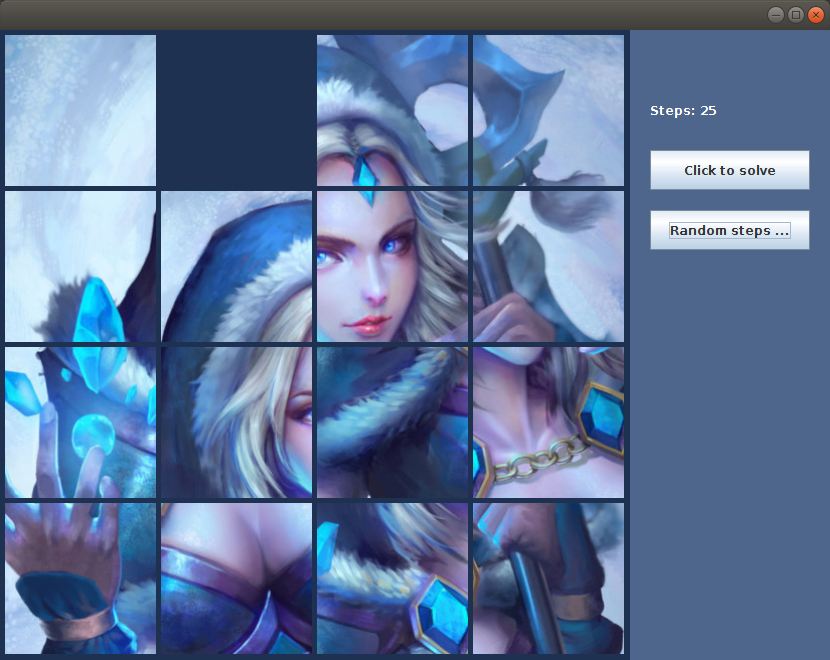

# Puzzle Block AI
Some basic AI theories implemented in a game. A simple route-finding algorithm, my first step towards the AI field. The program is written in C++ for route-finding and Java for UI.
<br>

<p align="center"></img></p>

You can try this program by cloning the repository and running the makefile.

```bash
git clone https://github.com/khantkyawkhaung/puzzle-block-ai
cd puzzle-block-ai
make
make run
```

